# Test4Test Case Study

## Designing and shipping a reciprocity-based usability testing marketplace

Test4Test is a usability testing platform for founders who need fast product feedback but do not have the budget, time, or panel access for traditional research. Instead of paying upfront, users submit an app or website, test other products to earn credits, and spend those credits to receive feedback on their own work.

My role covered product strategy, UX design, visual design direction, front-end engineering, and backend implementation. I took the product from an MVP product plan into a working React and Supabase application with submission flows, testing flows, credit mechanics, feedback review, email notifications, reporting, screen recording, and Google Play closed-test support.

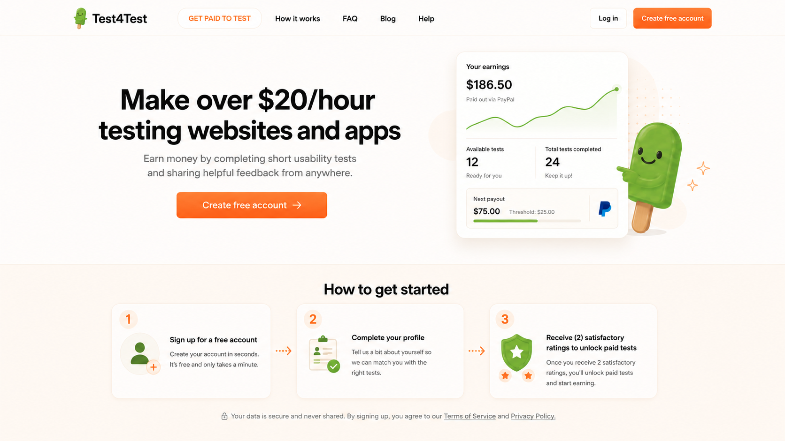

## At a glance

**Role:** Product manager, UX designer, UX engineer, full-stack implementer  
**Timeline reviewed:** March 27, 2026 to May 21, 2026  
**Stack:** React, TypeScript, Vite, Supabase Auth/Postgres/RPC/Edge Functions, Cloudflare Pages, Cloudflare R2, OpenAI question generation, SMTP2GO email  
**Live product:** [test4test.io](https://test4test.io/)  
**Public repo:** [github.com/omatthew-tech/Test4Test](https://github.com/omatthew-tech/Test4Test)  
**Project scale reviewed:** 159 commits, 17 React pages, 32 Supabase migrations, 14 Supabase Edge Function folders  
**Core product loop:** Submit a product, verify email, earn credits by testing other products, receive and rate feedback

## The problem

Early-stage founders need candid usability feedback before they have the resources for formal research. But low-cost feedback loops usually break in three places:

1. **Liquidity:** founders submit products, but there are not enough relevant testers.
2. **Trust:** feedback quality varies wildly, and users worry they are trading effort for low-value responses.
3. **Friction:** every extra sign-up step, unclear instruction, or platform mismatch reduces completion.

The product challenge was to design a marketplace that felt easy enough to start in minutes, fair enough to motivate reciprocity, and structured enough to protect feedback quality.

## Product strategy

I framed the MVP around one simple exchange:

> Test other products. Earn credits. Get feedback on yours.

That sentence became the product operating model. The design work was not only about screens. It was about making the exchange feel legible at every step:

- Submit before full account creation to reduce onboarding drop-off.
- Require live product links so testers can evaluate the real experience.
- Use credits and test-back signals to make contribution visible.
- Keep responses anonymous while still tracking quality internally.
- Let submitters rate feedback so the platform can learn which testers are useful.
- Add reminders and reporting so the marketplace does not rely on good intentions alone.

## Research signal

I used Test4Test itself as a feedback mechanism while building the product. Early responses gave me a clear prioritization signal: users wanted more feedback, but they also wanted confidence that the feedback would be useful and reciprocated.

In Version 1, the strongest answer to "What's the most important feature Test4Test should have?" was:

- Getting as much user feedback as possible: **43%**
- Getting high quality user feedback: **29%**
- Ensuring someone tests back my app if I test their app: **29%**
- Using feedback to implement new features in my app: **0%**

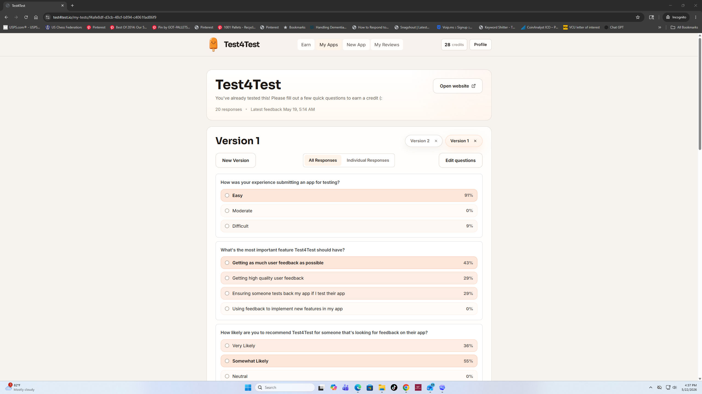

The open-ended feedback reinforced the same pattern. Users asked for a regular stream of testers, feedback within a clearer time limit, more genuine testers, and better ways to understand what kind of test they were about to complete.

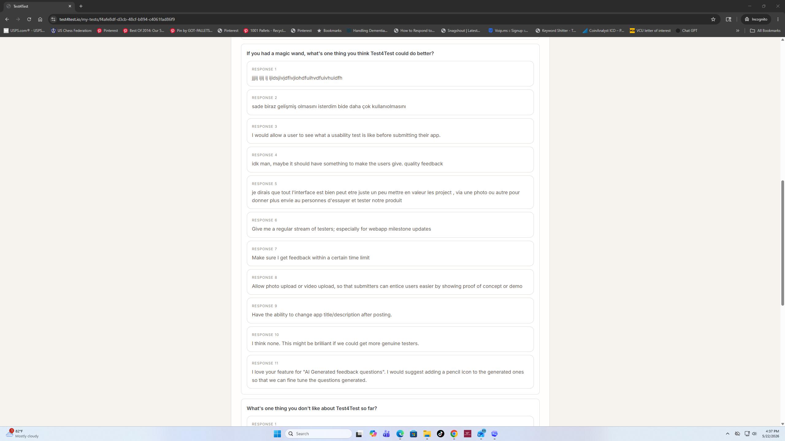

That research shifted the product from a simple credit exchange into a trust-and-reciprocity system. I implemented visible satisfaction and test-back rates, test-back reminder emails, and Earn-page logic that focuses users on reciprocal tests when someone has already tested their app.

In Version 2, after that trust work was underway, the priority signal sharpened:

- Getting high quality user feedback: **44%**
- Ensuring someone tests back my app if I test their app: **44%**
- Getting as much user feedback as possible: **11%**
- Using feedback to implement new features in my app: **0%**

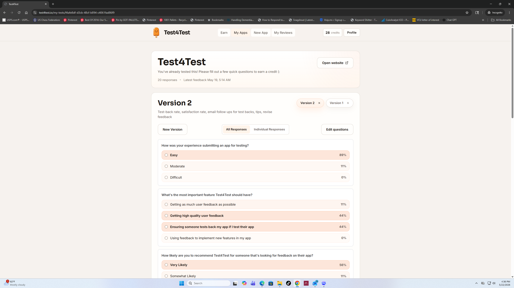

The Version 2 open-ended responses kept pointing toward reliability: more testers, clearer matching, clearer feedback collection, and more confidence that testers would genuinely try the product.

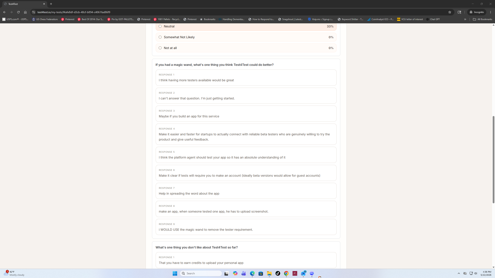

I read that as a product direction change: the marketplace could not only optimize for volume. It had to make quality and fairness visible.

## Design process

### 1. Turning the Earn page into a marketplace control surface

The early Earn page used a broad app-type filter. It worked as a list, but it did not fully solve marketplace fit. Users could still be shown tests they could not reliably complete, especially across web, iOS, Android, and closed-test scenarios.

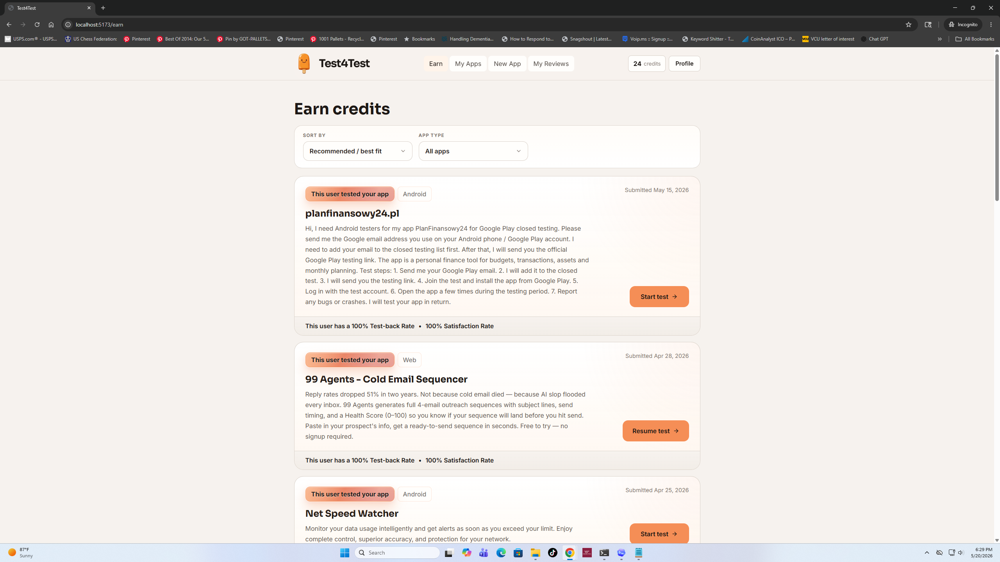

I redesigned the interaction around tester capability: "What platforms can you reliably access?" This changed the filter from a passive sorting tool into a marketplace quality control. The preference modal made users explicitly confirm which platforms they could test, then persisted those preferences.

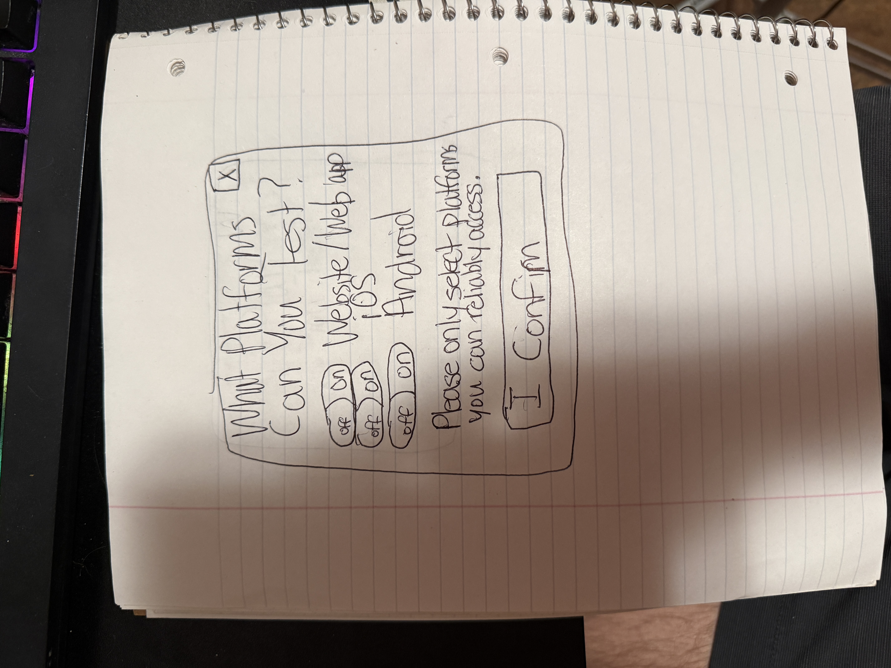

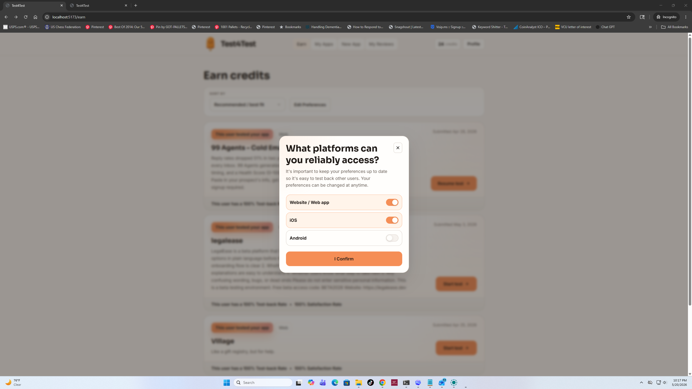

The after state surfaces selected platforms directly in the Earn controls, keeps the action lightweight, and makes the user's testing pool more relevant.

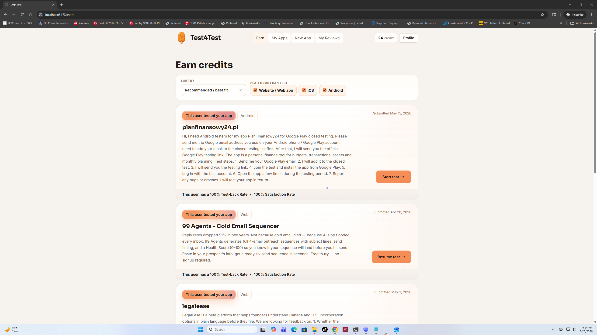

**Why this mattered:** platform mismatch is a hidden conversion killer. A founder needing Android testers does not benefit from iOS-only users seeing the task. A tester does not benefit from opening a test they cannot complete. This change made the marketplace more honest.

### 2. Reducing submission friction without losing accountability

The submission flow was designed around delayed authentication. Users can begin by naming and configuring their app, then verify email only after submission. That preserves momentum while still creating an accountable identity before feedback and credits enter the system.

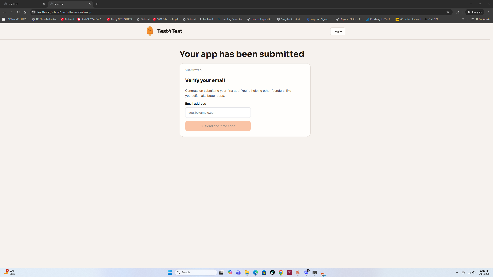

The wizard supports multiple product types, live access links, AI-generated questions, custom questions, and screen-plus-voice recording. It also gives users a review step so they can inspect the test before publishing.

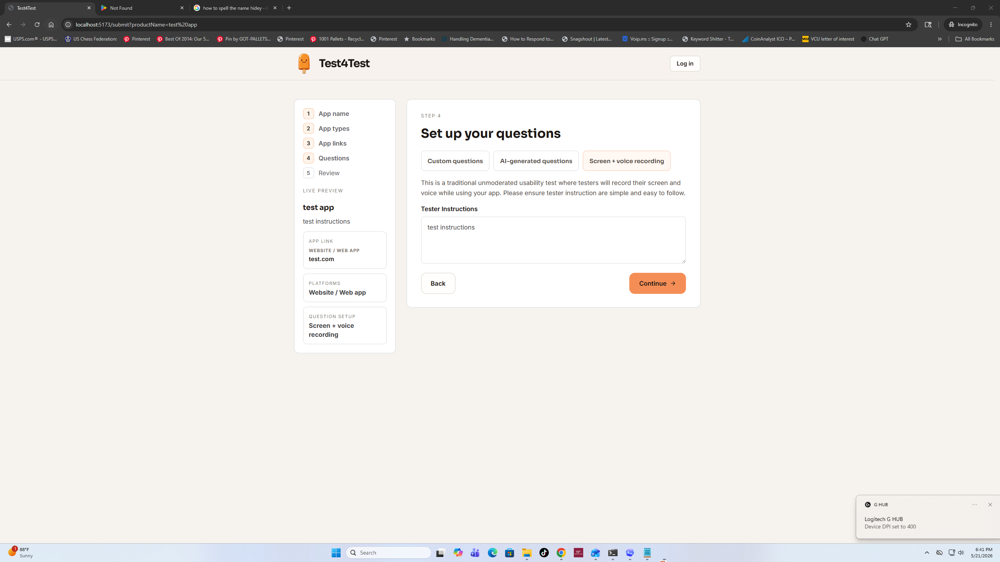

**UX decision:** do not ask for an account before the user understands the value. The system captures intent first, then asks for verification at the moment when the user has something to protect.

### 3. Improving feedback quality with screen and voice recording

Text feedback is useful, but early usability research often needs behavior, hesitation, and spoken reasoning. I added screen-plus-voice recording as an advanced test type and iterated heavily on the tester instructions.

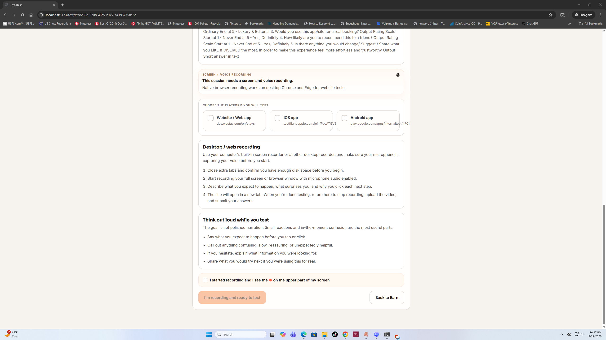

The implementation evolved beyond a file upload field. The shipped flow supports:

- Desktop browser recording for web tests in supported browsers.
- iOS and Android recording instructions for mobile tests.
- Recording preflight states.
- Microphone permission handling.
- Upload progress and retry behavior.
- Backup download if automatic upload fails.
- A floating recorder control for desktop sessions.
- Recording access and retention rules for submitters.

**UX decision:** recording flows fail when users are unsure whether they are doing the right thing. The design uses preflight checks, explicit platform-specific instructions, and gated submit states so testers know exactly when a recording is required and when it has been accepted.

### 4. Designing trust loops into the marketplace

Test4Test cannot succeed if low-effort feedback earns the same value as thoughtful feedback. The feedback data made that clear: users were explicitly asking for high-quality feedback and assurance that other founders would test back. I added multiple layers of quality and trust:

- Feedback ratings with frowny, neutral, and smiley reactions.
- "This user tested your app" signals in the Earn list.
- Test-back rate and satisfaction rate shown on tester/founder cards.
- Reporting for bad ratings and inaccessible or suspicious tests.
- Admin and moderation flows for bans, reports, and credit adjustments.
- Test-back reminder emails that nudge users to reciprocate and warn that the public test-back rate can drop after unresolved reminders.
- Earn-page prioritization that focuses users on tests from people they owe a test back to when reciprocal opportunities exist.

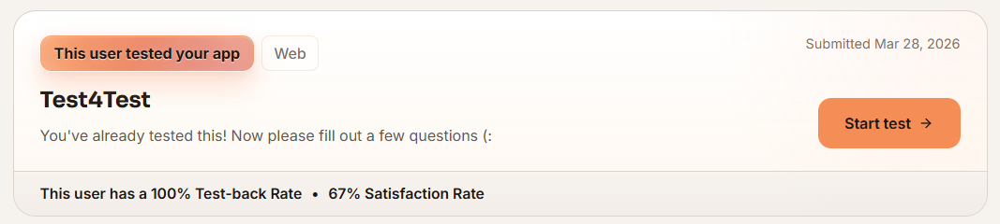

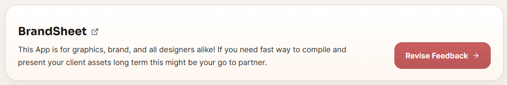

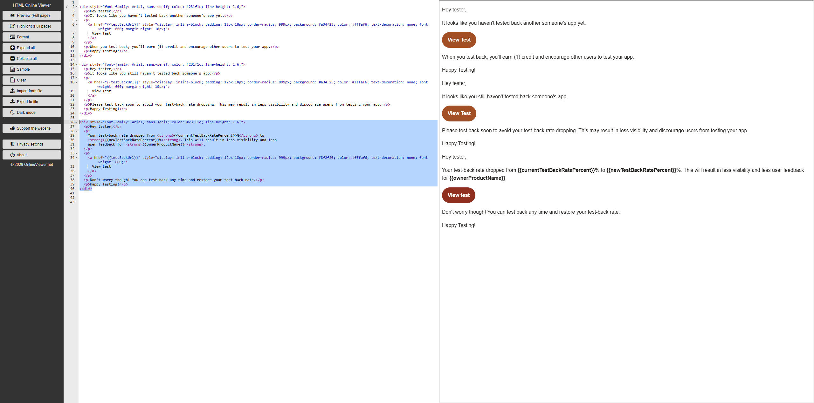

**Product decision:** trust is not a post-launch add-on for a reciprocal marketplace. It is part of the core loop. The product has to reward users who give useful feedback, make reciprocity visible, and protect users from bad-faith or incomplete work.

This became a concrete product system:

- **Satisfaction rate** reflects how submission owners rate the usefulness of the feedback they receive.
- **Test-back rate** reflects whether users reciprocate after someone tests their app.
- **Reminder emails** create a grace period before reputation consequences apply.
- **Earn-page matching** pushes users toward the tests that keep the reciprocal loop healthy.
- **Reports and revisions** give users a path to challenge bad ratings or improve submitted feedback.

### 5. Supporting a niche but urgent user segment: Google Play closed tests

The commit history showed a clear product pivot toward Android founders who need help with Google Play closed-test participation. I designed and implemented a separate closed-test path instead of forcing that behavior into the normal one-session feedback model.

The Google Play closed-test workflow includes:

- Android-only closed-test submission constraints.
- Closed-test instructions in the submission flow.
- A separate matching pool for closed-test founders.
- Participation records with daily check-ins.
- A 14-day follow-through model.
- Daily reminder support through Edge Functions.
- Owner progress views for active, completed, and missed participation.

**PM decision:** this was a segment-specific workflow with different success criteria than normal usability feedback. Treating it as its own product lane kept the general testing experience simpler while giving Android founders a purpose-built path.

## UX engineering highlights

The case study is strongest because the design decisions were shipped, not only mocked up.

Key implementation areas:

- **React app architecture:** 17 pages covering home, submit, verify, earn, test session, success, my apps, results, revisions, profile, credits, admin, and banned states.
- **Submission and question system:** live product links, multi-platform submissions, AI question generation, editable custom questions, question-set versioning, and app versioning.
- **Credit economy:** starter credits, earned-test transactions, credits page, and credit-aware Earn prioritization.
- **Marketplace matching:** excludes owned/completed submissions, prioritizes reciprocal test-back opportunities, narrows the Earn page to test-back opportunities when they exist, considers founder credit balance, filters by reliable platform access, and separates Google Play closed-test pools.
- **Recording infrastructure:** browser recording, manual upload fallback, Cloudflare R2 storage, multipart upload support, recording deletion, retention windows, and signed access.
- **Emails and reminders:** OTP, new feedback, test-back reminders, tip payment method notifications, and closed-test reminder functions.
- **Safety systems:** feedback ratings, report flows, test reports, moderation states, account bans, and schema-backed admin review.
- **Analytics foundation:** site visit, authenticated visit, submission step views, test completion, and first-test completion events.

## Visual system

The interface uses a warm, restrained brand system built around creamsicle orange, soft neutral surfaces, and small mascot moments. The product plan and style guide emphasize:

- A product-first UI with mascot personality used sparingly.
- One primary action per screen.
- Clear progress indicators in multi-step flows.
- Warm but accessible surfaces, borders, and button states.
- Dense enough dashboard views for repeated use, without making the product feel heavy.

The mobile work included navigation simplification, hamburger behavior, profile relocation, and logo alignment fixes.

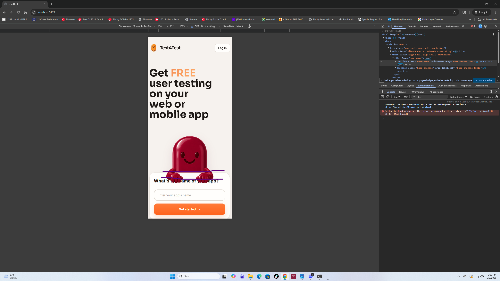

## Outcome

In roughly eight weeks, Test4Test moved from initial MVP to a full working product system:

- Users can submit a website or app and verify by email OTP.
- Users can earn credits by completing tests.
- Submitters can review responses, rate feedback quality, and revise tests.
- The product supports AI-generated and custom question sets.
- Feedback research directly informed the trust system: satisfaction rate, test-back rate, reciprocal Earn-page matching, and test-back reminder emails.
- Screen and voice recording tests are supported with upload and recovery states.
- The marketplace includes reciprocal test-back signals, reporting, and moderation.
- Google Play closed-test founders have a dedicated matching and reminder workflow.
- The application is prepared for free-stack deployment through Cloudflare Pages and Supabase.

I would avoid claiming conversion or revenue impact until production analytics are available. The current measurable outcomes are shipped product breadth, technical completeness, and improved UX quality across the core marketplace loop.

## What I would measure next

To evaluate the product loop, I would track:

- Submission start to submission completion rate.
- Email verification completion rate.
- Earn page test-start rate.
- Test-start to test-submission completion rate.
- Draft recovery rate and resume-test usage.
- Percentage of users who test back after receiving feedback.
- Average time to first feedback.
- Feedback rating distribution.
- Recording-test completion rate by platform.
- Report rate by product type and test type.
- Google Play closed-test day-by-day retention.

## What I learned

This project pushed me to design like a product manager and implement like a UX engineer. The hardest problems were not isolated screens. They were loops: how users enter the marketplace, how they know what to do, how they trust the people on the other side, and how the system handles edge cases without making the happy path feel complicated.

The most important design lesson was that fairness has to be visible. Test-back rate, satisfaction rate, reporting, reminders, and platform preferences all make the exchange more legible. Users are more likely to contribute when they can see that the system notices effort and protects them from low-quality participation.

## Portfolio image plan

Recommended website layout:

1. **Hero image:** `assets/tester-landing-mockup.png`
2. **Marketplace before/after:** `assets/earn-before.png` and `assets/earn-platform-filter-after.png`
3. **Sketch to shipped UI:** `assets/platform-preferences-sketch.jpg` and `assets/platform-preferences-modal.png`
4. **Research evidence:** `assets/feedback-v1-priorities.png`, `assets/feedback-v2-priorities.png`, and `assets/feedback-v2-open-ended.png`
5. **Submission/auth flow:** `assets/submission-email-verification.png`
6. **Recording workflow:** `assets/recording-test-before.png`
7. **Trust signals:** `assets/satisfaction-testback-signal.png`, `assets/revise-feedback-example.png`, and `assets/test-back-email-editing.png`

## Short portfolio version

**Test4Test - UX, Product, and Engineering Case Study**

I designed and built Test4Test, a reciprocity-based usability testing platform where founders earn feedback credits by testing other products. The project turned a simple MVP concept into a full marketplace system with multi-step submission, email OTP verification, AI and custom test questions, credit-based earning, screen and voice recording, feedback ratings, reporting, reminders, and Google Play closed-test support.

My work spanned product strategy, UX flows, visual design, React implementation, Supabase schema design, Edge Functions, email systems, analytics events, and Cloudflare R2 recording storage. I used feedback from the product itself to guide roadmap decisions. When early users ranked "getting as much user feedback as possible" at 43%, "getting high quality user feedback" at 29%, and "ensuring someone tests back my app if I test their app" at 29%, I focused the next iteration on visible trust signals and reciprocity.

Key product decisions included delaying account creation until after submission intent, adding platform preference matching to prevent impossible tests, surfacing test-back and satisfaction signals, sending test-back reminder emails, focusing the Earn page on reciprocal tests when users owed a test back, and creating a separate closed-test workflow for Android founders with 14-day participation needs. The result is a working product that demonstrates end-to-end UX thinking across onboarding, marketplace liquidity, trust, feedback quality, and technical execution.

## Resume bullets

- Designed and shipped Test4Test, a React/Supabase usability testing marketplace with submission flows, credit earning, feedback review, screen recording, reporting, reminders, and Google Play closed-test workflows.
- Product-managed the exchange loop from MVP plan to implementation, using user feedback to prioritize satisfaction rate, test-back rate, reciprocal Earn-page matching, reminder emails, and analytics instrumentation.
- Built the UX engineering foundation across 17 app pages, 32 database migrations, 14 Edge Function folders, Cloudflare R2 recording storage, OTP auth, email notifications, and OpenAI-assisted question generation.

## Additional materials that would make this stronger

- Current production screenshots for the final state of the submit flow, recording flow, My Apps results page, and Google Play closed-test progress UI.
- Any user quotes, support messages, Discord/community feedback, or notes from founders/testers.
- Analytics from Supabase, Cloudflare, or the custom tracking table: start rates, completion rates, test-back rate, time to first feedback, and recording completion rate.
- A short note on whether the product is public beta, private beta, or still pre-launch.
- Role context: whether this was solo, with collaborators, or assisted by contractors/tools.
- Any constraints that shaped tradeoffs, such as timeline, budget, limited research access, or policy requirements.
